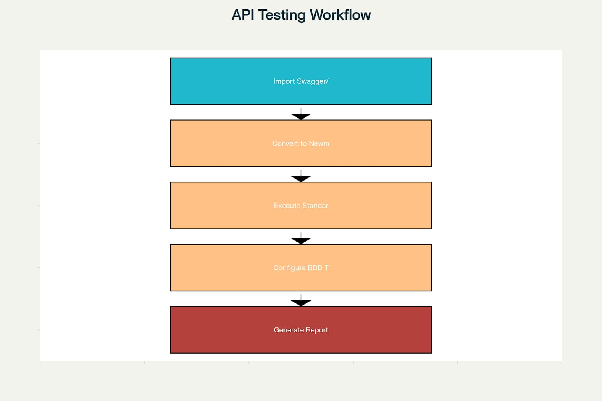
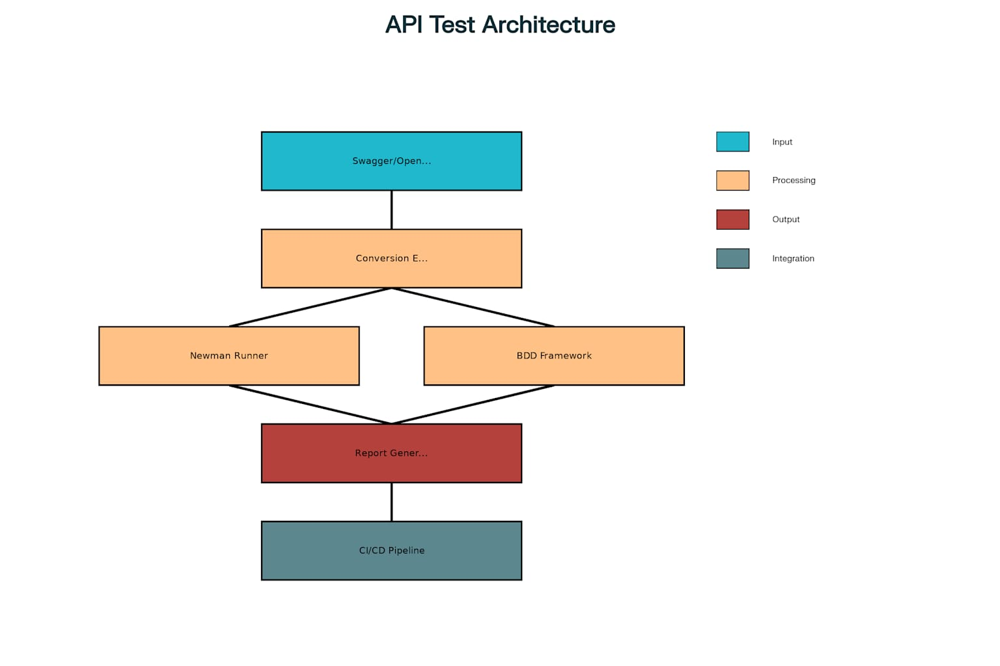
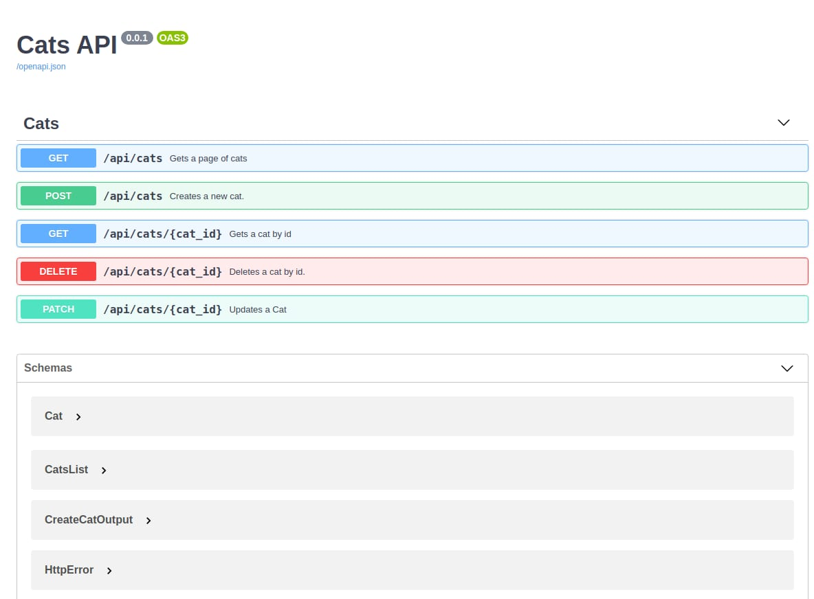
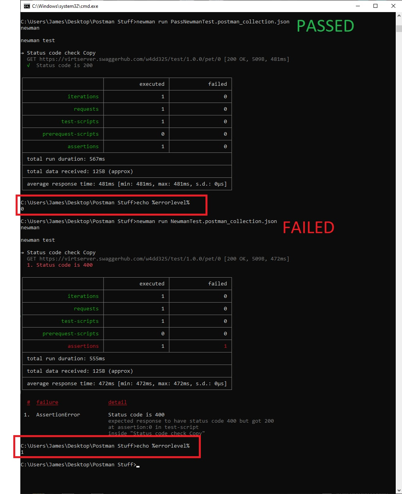
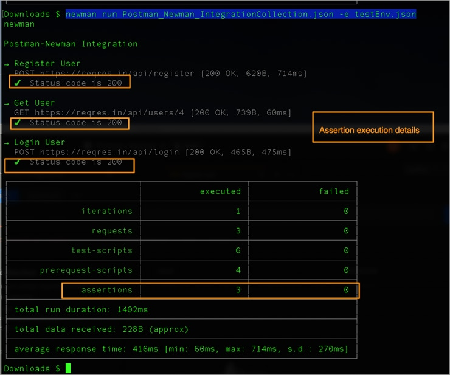
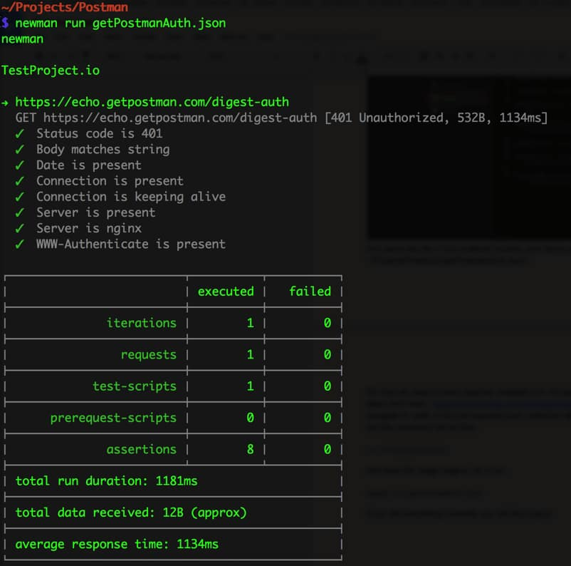
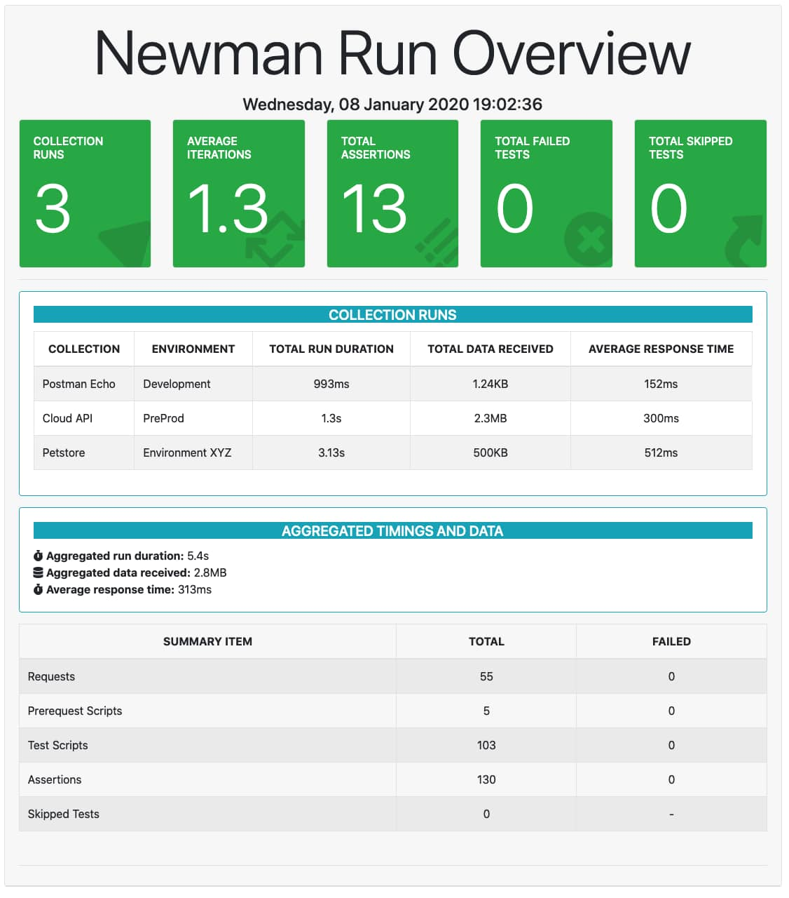
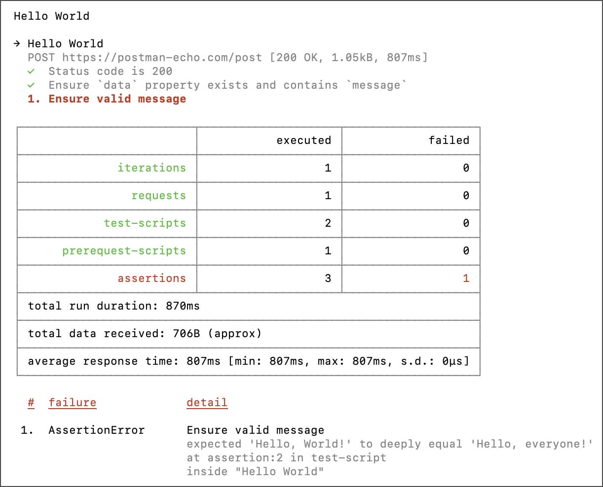
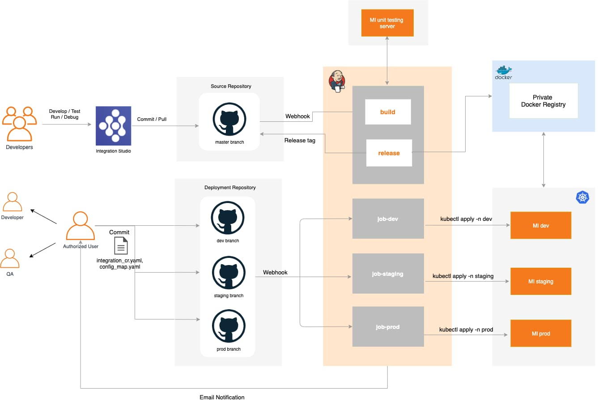

# Automated API Testing with Newman & Swagger



Um projeto de testes inovador que recebe especificações Swagger/OpenAPI e gera automaticamente collections Newman, executando testes para cada rota e método HTTP de forma completamente automatizada.

## Índice

- [Visão Geral](#visão-geral)
- [Fluxo de Trabalho](#fluxo-de-trabalho)
- [Arquitetura](#arquitetura)
- [Componentes Principais](#componentes-principais)
- [Fases do Pipeline](#fases-do-pipeline)
- [Geração de Relatórios](#geração-de-relatórios)
- [Benefícios](#benefícios)
- [Como Usar](#como-usar)

---

## Visão Geral

Este projeto automatiza testes de API ao:

1. Importar especificação Swagger/OpenAPI
2. Converter em uma collection Newman
3. Executar testes padrão para cada endpoint
4. Adicionar testes BDD para fluxos complexos
5. Gerar relatórios detalhados

---

## Fluxo de Trabalho

1. **Importar Swagger**
   
2. **Converter e Executar Testes**
   
3. **Configurar Testes BDD**
   
4. **Geração de Relatórios**
   

---

## Arquitetura



A arquitetura é simples e escalável, combinando Swagger/OpenAPI com Newman para criar um pipeline de testes robusto.

---

## Componentes Principais

1. **Swagger/OpenAPI**
   
2. **Conversor para Newman**
   
3. **Runner de Testes (Newman)**
   
4. **Reporters**
   

---

## Fases do Pipeline

1. **Importação**: Leitura da especificação da API.
2. **Conversão**: Geração automática de stubs de teste.
3. **Execução**: Execução dos testes via linha de comando.
4. **BDD**: Validação de fluxos avançados.
5. **Relatórios**: Saída em HTML e XML.

---

## Geração de Relatórios

- HTML interativo
- XML para integração com CI/CD

---

## Benefícios

- Automação total de testes de API
- Integração fácil com pipelines CI/CD
- Testes BDD legíveis e manuteníveis
- Relatórios detalhados para stakeholders

---

## Como Usar

1. Clone o repositório:
   ```bash
   git clone https://github.com/govinda777/automated-api-testing--with-newman--and-swagger.git
   ```
2. Instale as dependências:
   ```bash
   npm install
   ```
3. Execute o pipeline de testes:
   ```bash
   npm test
   ```

---

© 2025 Govinda Systems
