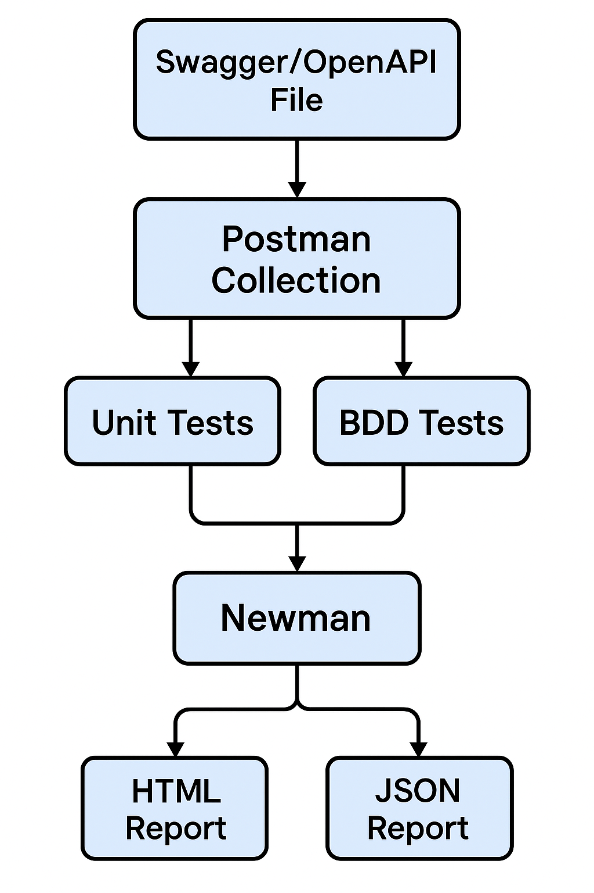

# Automated API Testing with Newman & Swagger



Este projeto oferece um framework robusto para automatizar testes de API, convertendo especificações Swagger/OpenAPI em coleções Postman/Newman executáveis, complementadas por testes BDD (Behavior-Driven Development) utilizando Cucumber.js.

## Índice

- [Visão Geral](#visão-geral)
- [Estrutura de Pastas](#estrutura-de-pastas)
- [Pré-requisitos](#pré-requisitos)
- [Configuração Inicial](#configuração-inicial)
- [Fluxo de Trabalho Típico](#fluxo-de-trabalho-típico)
- [Comandos Disponíveis (NPM Scripts)](#comandos-disponíveis-npm-scripts)
- [Servidor de Mock (Mock Server)](#servidor-de-mock-mock-server)
- [Estratégia de Testes](#estratégia-de-testes)
- [Geração de Relatórios](#geração-de-relatórios)
- [Configuração de Ambiente](#configuração-de-ambiente)
- [Integração CI/CD](#integração-cicd)
- [Documentação Detalhada](#documentação-detalhada)
- [Benefícios](#benefícios)

---

## Visão Geral

O objetivo principal é simplificar e acelerar o processo de testes de API através da automação:
1.  **Importação de Especificação:** Ingestão de arquivos Swagger/OpenAPI.
2.  **Geração de Coleção:** Conversão da especificação em uma coleção Postman, incluindo testes básicos para cada endpoint.
3.  **Execução de Testes Unitários de API:** Validação de cada endpoint individualmente usando Newman.
4.  **Execução de Testes BDD:** Validação de fluxos de usuário e cenários de negócio complexos com Cucumber.js.
5.  **Relatórios Detalhados:** Geração de múltiplos formatos de relatório (HTML, JUnit XML) para análise dos resultados.
Para uma representação visual da arquitetura geral do sistema e como os componentes interagem, veja o [Diagrama de Arquitetura Macro](./DIAGRAM.md#macro-level-system-architecture). Informações mais detalhadas sobre a arquitetura e os componentes da implementação atual estão disponíveis em [ARQ.md](./ARQ.md#detailed-component-descriptions-current-implementation) e na [documentação principal](./doc/index.html).

---

## Estrutura de Pastas

A estrutura do projeto é organizada da seguinte forma:

-   **/artifacts**: Contém arquivos gerados durante o processo de teste.
    -   **/collections**: Armazena as coleções Postman geradas (e.g., `generated-collection.json`).
    -   **/logs**: Guarda logs de execução de testes (e.g., `unit-tests.log`).
    -   **/reports**: Contém os relatórios de teste (e.g., `html-report.html`, `junit-report.xml`).
-   **/config**: Arquivos de configuração para diferentes ambientes.
    -   **/environments**: Contém arquivos YAML para configuração de variáveis de ambiente (e.g., `example.yaml`).
-   **/core**: Lógica central da aplicação.
    -   **/builders**: Scripts para construir/gerar artefatos (e.g., conversor de OpenAPI para Postman).
    -   **/monitoring**: (Se aplicável) Módulos para monitoramento.
    -   **/swagger**: Scripts para manipulação de arquivos Swagger/OpenAPI.
-   **/scripts**: Scripts utilitários e de setup.
    -   **/generators**: Scripts para geração de dados de teste dinâmicos (e.g., `example.js`).
    -   **/setup**: Scripts para configuração inicial do projeto.
-   **/tests**: Contém todos os arquivos relacionados a testes.
    -   **/bdd**: Testes de Behavior-Driven Development.
        -   **/features**: Arquivos Gherkin (`.feature`).
        -   **/step-definitions**: Implementações dos passos Gherkin em JavaScript.
        -   **/support**: Arquivos de suporte para Cucumber (e.g., hooks, world context).
    -   **/data**: Dados de teste estáticos em formato JSON (e.g., `sampleUser.data.json`).
    -   **/unit**: (Pode ser usado para testes unitários de código JavaScript, se necessário, usando Jest).
    -   **/utils**: Utilitários para os testes (e.g., `data-loader.js`).
-   **/img**: Imagens usadas na documentação.

---

## Pré-requisitos

-   Node.js (versão especificada em `package.json`, e.g., >=16.0.0)
-   npm (geralmente vem com Node.js)

---

## Configuração Inicial

1.  **Clone o repositório:**
    ```bash
    git clone https://github.com/govinda777/automated-api-testing--with-newman--and-swagger.git
    cd automated-api-testing--with-newman--and-swagger
    ```
2.  **Instale as dependências:**
    ```bash
    npm install
    ```

---

## Fluxo de Trabalho Típico

1.  **Importar a Especificação da API:**
    Use o comando `npm run import-swagger` para validar sua especificação OpenAPI/Swagger e copiá-la para `/core/swagger/swagger.yaml`.
    ```bash
    npm run import-swagger -- --file=./caminho/para/seu/swagger.yaml
    ```
2.  **Gerar a Coleção Postman:**
    Converta a especificação importada em uma coleção Postman (`/artifacts/collections/generated-collection.json`) com testes básicos.
    ```bash
    npm run generate-collection
    ```
3.  **Executar Testes Unitários de API:**
    Rode os testes da coleção gerada usando Newman.
    ```bash
    npm run test:unit
    ```
    *Nota:* A URL base e outras configurações para os testes de API serão carregadas a partir do arquivo de ambiente correspondente (e.g., `development.yaml` ou o especificado por `TEST_ENV` - veja [Configuração de Ambiente](#configuração-de-ambiente)).
4.  **Executar Testes BDD:**
    Execute os cenários de BDD definidos com Cucumber.js.
    ```bash
    npm run test:bdd
    ```
    *Nota:* Os testes BDD também utilizarão as configurações do ambiente ativo (e.g., `BASE_URL` definida em `process.env` pelo `hooks.js` - veja [Configuração de Ambiente](#configuração-de-ambiente)). Certifique-se que a API alvo esteja configurada e acessível.
5.  **Gerar e Visualizar Relatórios:**
    Gere relatórios consolidados dos testes de API.
    ```bash
    npm run report
    ```
    Para abrir o relatório HTML no seu navegador (se o comando `open` ou `xdg-open` estiver disponível):
    ```bash
    npm run report:open
    ```
    Ou abra manualmente o arquivo `/artifacts/reports/html-report.html`.

---

## Comandos Disponíveis (NPM Scripts)

-   `npm run import-swagger -- --file=<filePath>`: Valida um arquivo Swagger/OpenAPI e o copia para `/core/swagger/swagger.yaml`.
    -   Exemplo: `npm run import-swagger -- --file=./docs/swagger.yaml`
-   `npm run generate-collection`: Gera uma coleção Postman a partir do `/core/swagger/swagger.yaml` e a salva em `/artifacts/collections/generated-collection.json`, adicionando testes básicos para cada request (status code, validação de schema).
-   `npm run generate:data`: Executa o script `scripts/generators/example.js` para gerar massa de dados de teste dinâmica usando `@faker-js/faker`. Os dados são salvos, por padrão, em `tests/data/generated/dynamic-users.json`. Veja `tests/data/README.md` para mais detalhes sobre como usar e customizar a geração de dados.
-   `npm run test`: Executa testes Jest (se houver) e testes Cucumber.js (BDD). (Comportamento padrão original, pode ser ajustado).
-   `npm run test:unit`: Executa a coleção Postman gerada (`generated-collection.json`) com Newman, utilizando o ambiente configurado via `TEST_ENV` (padrão: `development`). Gera um relatório JSON e um log de console em `/artifacts/logs/`.
-   `npm run test:unit:folder <folderName>`: Executa apenas uma pasta específica dentro da coleção Postman gerada, utilizando o ambiente configurado. Substitua `<folderName>` pelo nome exato da pasta na coleção.
    -   Exemplo: `TEST_ENV=staging npm run test:unit:folder "User Management"`
-   `npm run test:bdd`: Executa os testes BDD (Cucumber.js) localizados em `/tests/bdd/features/`, utilizando o ambiente configurado via `TEST_ENV`.
-   `npm run report`: Gera relatórios de teste consolidados (JUnit XML e HTMLEXTRA HTML) em `/artifacts/reports/` a partir da execução da coleção `generated-collection.json`, utilizando o ambiente configurado via `TEST_ENV`.
-   `npm run report:dashboard`: Gera um dashboard HTML agregado (`artifacts/reports/dashboard.html`) a partir dos resultados JSON dos testes Newman e Cucumber. **Importante:** Execute `npm run test:unit`, `npm run test:bdd`, e `npm run report` (todos com o `TEST_ENV` desejado, se aplicável) *antes* deste comando para garantir que os dados de origem e links estejam corretos e atualizados.
-   `npm run report:open`: Tenta abrir o relatório HTML (`html-report.html`) no navegador padrão.
-   `npm run doc`: Gera documentação JSDoc (se configurado).
-   `npm run mock-server`: Inicia o servidor de mock da API utilizando o Prism. Veja a seção [Servidor de Mock (Mock Server)](#servidor-de-mock-mock-server) para mais detalhes.

---

## Servidor de Mock (Mock Server)

Para facilitar o desenvolvimento e testes isolados, este projeto inclui um servidor de mock baseado no Prism. Ele utiliza o arquivo de especificação OpenAPI (`core/swagger/swagger.yaml`) para simular o comportamento da API, retornando respostas dinâmicas baseadas nos exemplos e schemas definidos.

**Utilidade:**
-   Desenvolver o frontend ou outros serviços que dependem da API antes que ela esteja totalmente implementada.
-   Executar testes de contrato e de integração em um ambiente controlado sem depender de um backend real.
-   Isolar testes de componentes específicos que consomem a API.

**Como iniciar o servidor de mock:**

O servidor é iniciado utilizando o seguinte comando NPM:
```bash
npm run mock-server
```
Por padrão, o servidor iniciará na porta **4010**.

**Configurando a Porta:**

Você pode especificar uma porta diferente para o servidor de mock de duas maneiras:

1.  **Via variável de ambiente `PORT`:**
    A variável de ambiente `PORT` tem precedência sobre o argumento de linha de comando.
    ```bash
    PORT=4011 npm run mock-server
    ```
    O servidor será iniciado na porta `4011`.

2.  **Via argumento de linha de comando `--port`:**
    Utilize `--` para passar argumentos diretamente para o script `scripts/mock-server.js`.
    ```bash
    npm run mock-server -- --port=4011
    ```
    O servidor será iniciado na porta `4011`.

Se nenhuma porta for especificada através da variável de ambiente ou argumento de linha de comando, o servidor usará a porta padrão `4010`. O servidor também exibirá no console qual arquivo Swagger está sendo usado e em qual porta ele está rodando.

É importante notar que, atualmente, o servidor de mock não detecta automaticamente alterações no arquivo `core/swagger/swagger.yaml` enquanto está em execução. Se você modificar a especificação da API, precisará reiniciar manualmente o servidor de mock (Ctrl+C e depois `npm run mock-server`) para que as alterações tenham efeito.

---

## Estratégia de Testes

O projeto emprega uma estratégia de testes em múltiplas camadas:

-   **Testes Unitários de API (Newman):** A coleção Postman gerada automaticamente (`generated-collection.json`) a partir da especificação OpenAPI é ideal para validar cada endpoint individualmente. Estes testes, executados com `npm run test:unit` (ou `npm run test:unit:folder <folderName>` para pastas específicas), verificam aspectos como status codes corretos (`2xx`) e a conformidade da estrutura da resposta com o schema JSON esperado (validação de contrato). Esta abordagem é excelente para garantir a saúde básica e a conformidade de cada endpoint da API.
        Para um diagrama detalhado do fluxo de execução destes testes Newman, consulte o [Fluxo de Execução de Testes (Newman)](./DIAGRAM.md#test-execution-flow-newman).

-   **Testes de Comportamento (BDD - Cucumber.js):** Para validar fluxos de usuário e cenários de negócio mais complexos, que podem envolver múltiplas interações com a API, utilizamos Cucumber.js. Os cenários são definidos em linguagem Gherkin (`.feature`) e os *step definitions* (passos) são implementados em JavaScript.
    -   **Abordagem de Interação com a API:** Dentro dos *step definitions* do Cucumber, a interação com a API é realizada através de chamadas HTTP diretas, utilizando bibliotecas como `axios` (já inclusa no projeto). Esta abordagem oferece maior controle sobre as requisições e respostas, permite construir e manipular dados de forma programática entre os passos, e mantém os cenários BDD focados no comportamento do usuário, não na estrutura de uma coleção Postman. Tentar reutilizar requisições de uma coleção Postman diretamente dentro dos steps do Cucumber pode levar a um acoplamento desnecessário e dificultar a clareza dos testes de comportamento.
    -   **Foco no Comportamento:** Os testes BDD devem descrever o comportamento do sistema da perspectiva do usuário (e.g., "Dado que um usuário está logado, Quando ele tenta criar um novo pedido com itens válidos, Então o pedido deve ser criado com sucesso"). A lógica de como cada passo interage com a API fica encapsulada nos *step definitions*.

-   **Complementaridade entre Testes Newman e BDD:**
    -   **Newman/Postman Collections:** Excelentes para testes de contrato, validação de schema por endpoint, e testes rápidos de regressão em nível de API individual. São gerados a partir do Swagger e garantem que cada "unidade" da API funcione conforme especificado.
    -   **Cucumber.js (BDD):** Ideal para testes de integração de ponta a ponta (do ponto de vista da API), fluxos de usuário complexos, e cenários que envolvem múltiplos passos ou estados. Eles garantem que as diferentes partes da API trabalhem juntas corretamente para atender aos requisitos de negócio.

-   **Testes de Contrato (Schema Validation):** A validação de schema é primariamente tratada pelos testes gerados na coleção Postman (executados via Newman). No entanto, validações específicas também podem ser adicionadas nos testes BDD se um determinado fluxo de comportamento depender crucialmente de uma estrutura de dados específica em um ponto intermediário.

-   **Análise Estática:** Ferramentas como ESLint (se configuradas) ajudam a manter a qualidade e consistência do código dos próprios testes.

-   **Massa de Dados para Testes:**
    -   **Dados Estáticos:** Para dados de teste que raramente mudam ou que precisam ser consistentes entre as execuções, utilize arquivos JSON estáticos armazenados em `/tests/data/`. Veja `tests/data/README.md` para convenções de nomenclatura e estrutura.
    -   **Dados Dinâmicos:** O projeto suporta a geração de massa de dados dinâmicos usando `@faker-js/faker` através do comando `npm run generate:data`. Isso é útil para criar uma grande variedade de entradas de teste e evitar a repetição de dados. Consulte a documentação em `tests/data/README.md` (seção "Geração Dinâmica de Massa de Dados") para detalhes sobre como gerar e utilizar esses dados em seus testes.

---

## Geração de Relatórios

-   **HTML (HTMLEXTRA)**: Um relatório HTML interativo e detalhado é gerado em `/artifacts/reports/html-report.html`. Este relatório oferece uma visão amigável dos resultados dos testes, incluindo detalhes de requisições, respostas e asserções.
    -   Para visualizar o relatório, abra o arquivo `artifacts/reports/html-report.html` em seu navegador.
    -   Um script auxiliar opcional `npm run report:open` tenta abrir o relatório automaticamente.
        O processo de como estes e outros relatórios são gerados é detalhado no [Fluxo de Geração de Relatórios](./DIAGRAM.md#report-generation-flow).
-   **JUnit XML**: Um relatório em formato XML compatível com JUnit é gerado em `/artifacts/reports/junit-report.xml`. Este formato é comumente usado para integração com sistemas de Integração Contínua (CI/CD) como Jenkins, GitLab CI, etc.
-   **CLI**: Saída de console (Command Line Interface) é exibida durante a execução dos testes Newman, fornecendo feedback imediato.
-   **Logs de Testes Unitários**: Logs detalhados da execução de `npm run test:unit` são salvos em `/artifacts/logs/unit-tests.log`, e um relatório JSON cru também é gerado em `/artifacts/logs/unit-tests-report.json`.

Os relatórios Newman são gerados executando o comando `npm run report`.

-   **Dashboard Agregado**:
    -   Um dashboard HTML simples é gerado em `artifacts/reports/dashboard.html` através do comando `npm run report:dashboard`.
    -   Este dashboard consolida os resultados dos testes unitários/Newman e dos testes de comportamento/Cucumber, fornecendo uma visão geral do status dos testes.
    -   Ele exibe totais, passados, falhados e duração para cada tipo de teste, além de um resumo geral.
    -   O dashboard também inclui um link para o relatório HTML detalhado do Newman (`html-report.html`), se disponível.
    -   **Pré-requisitos:** Para que o dashboard reflita o estado mais recente, certifique-se de executar `npm run test:unit` (para gerar `unit-tests-report.json`), `npm run test:bdd` (para gerar `bdd-report.json`), e `npm run report` (para gerar `html-report.html` que é linkado) *antes* de executar `npm run report:dashboard`.

---

## Configuração de Ambiente

Este projeto suporta configurações de ambiente dinâmicas para adaptar os testes a diferentes cenários (desenvolvimento, staging, produção, etc.). A configuração é controlada pela variável de ambiente `TEST_ENV`.

**Arquivos de Configuração YAML:**

-   As configurações específicas de cada ambiente são definidas em arquivos YAML localizados em `config/environments/`.
-   Por exemplo:
    -   `config/environments/development.yaml` (usado por padrão se `TEST_ENV` não estiver definida)
    -   `config/environments/staging.yaml`
    -   `config/environments/example.yaml` (serve como modelo)
-   Cada arquivo YAML pode conter pares chave-valor, como `baseUrl`, `apiKey`, etc.
    ```yaml
    # config/environments/development.yaml
    environmentName: "Development"
    baseUrl: "http://localhost:1234/api/dev"
    apiKey: "dev_api_key_123"
    timeout: 5000
    ```

**Seleção do Ambiente:**

-   A variável de ambiente `TEST_ENV` determina qual arquivo de configuração é carregado.
    -   Se `TEST_ENV` for definida (ex: `TEST_ENV=staging`), o arquivo `config/environments/staging.yaml` será usado.
    -   Se `TEST_ENV` não for definida, o sistema usará `development` como padrão, carregando `config/environments/development.yaml`.

**Uso em Testes Cucumber (BDD):**

-   O script `tests/bdd/support/hooks.js` é responsável por carregar o arquivo YAML do ambiente ativo no início da execução dos testes Cucumber.
-   Ele lê o arquivo YAML correspondente (baseado em `TEST_ENV` ou o padrão 'development').
-   As variáveis do arquivo YAML (como `baseUrl`, `apiKey`) são então injetadas como variáveis de ambiente (`process.env.BASE_URL`, `process.env.API_KEY`, etc.).
-   Isso torna as configurações do ambiente facilmente acessíveis dentro dos seus step definitions.
    ```javascript
    // Exemplo de acesso em um step definition:
    // const apiUrl = process.env.BASE_URL + '/users';
    // const currentApiKey = process.env.API_KEY;
    ```

**Uso em Testes Newman (Unitários de API):**

-   Para os testes Newman (comandos `npm run test:unit`, `npm run report`), a configuração de ambiente é gerenciada pelo script `scripts/setup/prepare-newman-env.js`.
-   Este script é executado automaticamente como parte dos scripts `pretest:unit` e `prereport` (definidos em `package.json`).
-   **Funcionamento:**
    1.  O script `prepare-newman-env.js` lê o arquivo YAML do ambiente ativo (baseado em `TEST_ENV` ou o padrão 'development'), da mesma forma que os hooks do Cucumber.
    2.  Ele transforma o conteúdo do YAML em um arquivo de ambiente no formato JSON compatível com Postman/Newman.
    3.  Este arquivo JSON é salvo em `artifacts/environments/newman_env.json`.
-   Os comandos Newman em `package.json` (como `test:unit` e `report`) são configurados para usar este arquivo JSON gerado através do argumento `--environment artifacts/environments/newman_env.json`. Isso elimina a necessidade de passar variáveis como `--env-var "baseUrl=..."` diretamente na linha de comando para Newman.

**Exemplo de Uso:**

-   Para usar o ambiente de desenvolvimento (padrão):
    ```bash
    npm run test:unit
    npm run test:bdd
    ```
-   Para usar um ambiente chamado `staging` (assumindo que `config/environments/staging.yaml` existe):
    ```bash
    TEST_ENV=staging npm run test:unit
    TEST_ENV=staging npm run test:bdd
    TEST_ENV=staging npm run report
    ```

**Importante:**
-   Lembre-se de criar os arquivos YAML correspondentes em `config/environments/` para cada ambiente que você deseja suportar.
-   **Não commite arquivos de ambiente com dados sensíveis** (como chaves de API de produção) no repositório. Use `.gitignore` para excluir arquivos específicos (e.g., `production.yaml`) e gerencie-os de forma segura, por exemplo, através de secrets em seu sistema de CI/CD.

---

## Integração CI/CD

Este projeto é projetado para ser facilmente integrado em pipelines CI/CD (e.g., GitHub Actions, Jenkins, GitLab CI).

**Passos Básicos do Pipeline:**

1.  **Checkout do Código:** Obtenha a versão mais recente do repositório.
2.  **Instalação de Dependências:** Execute `npm install`.
3.  **Importar Swagger (se aplicável):** Se seu arquivo Swagger é um artefato de um passo anterior do build ou precisa ser buscado, execute `npm run import-swagger -- --file=./caminho/para/seu/swagger.yaml`.
4.  **Gerar Coleção:** Execute `npm run generate-collection`.
5.  **Executar Testes:**
    *   Testes Unitários de API: `npm run test:unit`
    *   Testes BDD: `npm run test:bdd` (garanta que seu ambiente de teste e serviços estejam disponíveis)
6.  **Publicar Relatórios:** Os relatórios são gerados em `/artifacts/reports/`. Eles podem ser arquivados ou publicados pelo seu sistema de CI/CD. Relatórios JUnit XML (`junit-report.xml`) são particularmente úteis para integração com plataformas de CI para exibir os resultados dos testes.

Melhorias futuras podem incluir gerenciamento de ambiente mais sofisticado dentro do pipeline CI/CD e implantação automatizada baseada nos resultados dos testes.
O arquivo existente `.github/workflows/static.yml` fornece um exemplo de um workflow do GitHub Actions, que pode ser expandido para automação completa de testes.
Uma visualização detalhada deste fluxo de trabalho do GitHub Actions pode ser encontrada no [Diagrama do Pipeline de CI/CD](./DIAGRAM.md#cicd-pipeline-flow).

---

## Documentação Detalhada

Além deste README, o projeto conta com documentação mais aprofundada:

-   **[Documentação Principal (HTML)](./doc/index.html):** Apresenta uma visão geral navegável do projeto, seus fluxos, benefícios e outros aspectos, ideal para ser servida via GitHub Pages.
-   **[Diagramas da Arquitetura e Fluxos (DIAGRAM.md)](./DIAGRAM.md):** Contém diagramas Mermaid que ilustram a arquitetura macro do sistema, o pipeline de CI/CD, o fluxo de execução de testes Newman e o fluxo de geração de relatórios.
-   **[Detalhes da Arquitetura e Componentes (ARQ.md)](./ARQ.md):** Oferece uma discussão sobre a arquitetura proposta e descrições detalhadas dos componentes chave da implementação atual do sistema.

Recomenda-se consultar estes documentos para um entendimento completo da estrutura e funcionamento do projeto.

---

## Benefícios

-   Automação abrangente de testes de API, desde a especificação até a execução.
-   Geração automática de coleções Postman a partir de especificações OpenAPI.
-   Suporte para testes unitários de API (Newman) e testes de comportamento (BDD com Cucumber).
-   Relatórios detalhados em múltiplos formatos (HTML, JUnit).
-   Estrutura organizada para fácil manutenção e escalabilidade.
-   Facilidade de integração com pipelines CI/CD.

---

© 2025 Govinda Systems
